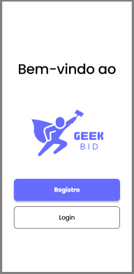

# Projeto de Interface

Pré-requisitos: <a href="2-Especificação do Projeto.md"> Documentação de Especificação</a>

Visão geral da interação do usuário pelas telas do sistema e protótipo interativo das telas com as funcionalidades que fazem parte do sistema (wireframes).

 Apresente as principais interfaces da plataforma. Discuta como ela foi elaborada de forma a atender os requisitos funcionais, não funcionais e histórias de usuário abordados nas <a href="2-Especificação do Projeto.md"> Documentação de Especificação</a>.

## Diagrama de Fluxo

O diagrama apresenta o estudo do fluxo de interação do usuário com o sistema interativo e  muitas vezes sem a necessidade do desenho do design das telas da interface. Isso permite que o design das interações seja bem planejado e gere impacto na qualidade no design do wireframe interativo que será desenvolvido logo em seguida.

O diagrama de fluxo pode ser desenvolvido com “boxes” que possuem internamente a indicação dos principais elementos de interface - tais como menus e acessos - e funcionalidades, tais como editar, pesquisar, filtrar, configurar - e a conexão entre esses boxes a partir do processo de interação. Você pode ver mais explicações e exemplos https://www.lucidchart.com/blog/how-to-make-a-user-flow-diagram.

As referências abaixo irão auxiliá-lo na geração do artefato “Diagramas de Fluxo”.

> **Links Úteis**:
> - [Fluxograma online: seis sites para fazer gráfico sem instalar nada | Produtividade | TechTudo](https://www.techtudo.com.br/listas/2019/03/fluxograma-online-seis-sites-para-fazer-grafico-sem-instalar-nada.ghtml)

## Wireframe Interativo

Conforme o diagrama de fluxo do projeto apresentado anteriormente, as telas do sistema são detalhadas nos itens subsequentes. 
Para acessar o wireframe interativo, acesse o ambiente https://www.figma.com/file/tvTmw6ooRbQybDahix2925/Geek-bid?type=design&node-id=0-1&mode=design&t=UTHXdQbq9iEme6Qg-0  disponível pela plataforma Figma.
 
As telas do sistema seguem uma estrutura padrão, conforme ilustrado na Figura 6. Nessa estrutura, identificamos dois principais blocos, os quais estão detalhados a seguir:
Conteúdo: exibe o conteúdo da tela em questão;
Barra de navegação: mostra os elementos de navegação disponíveis, que estão associados aos elementos do bloco de conteúdo.

- Tela inicial: 

A tela de navegação inicial foi projetada para proporcionar uma transição intuitiva entre as opções de login e registro. Ela apresenta os seguintes elementos:

Botão "Login": Ao clicar neste botão, os usuários são direcionados para a tela de login, onde podem inserir suas credenciais para acessar o sistema.

Botão "Registro": Esta opção permite que novos usuários criem uma conta no sistema. Ao clicar neste botão, os usuários são encaminhados para a tela de cadastro, onde podem preencher as informações necessárias para criar uma nova conta.

 
> **Links Úteis**:
> - [Protótipos vs Wireframes](https://www.nngroup.com/videos/prototypes-vs-wireframes-ux-projects/)
> - [Ferramentas de Wireframes](https://rockcontent.com/blog/wireframes/)
> - [MarvelApp](https://marvelapp.com/developers/documentation/tutorials/)
> - [Figma](https://www.figma.com/)
> - [Adobe XD](https://www.adobe.com/br/products/xd.html#scroll)
> - [Axure](https://www.axure.com/edu) (Licença Educacional)
> - [InvisionApp](https://www.invisionapp.com/) (Licença Educacional)
