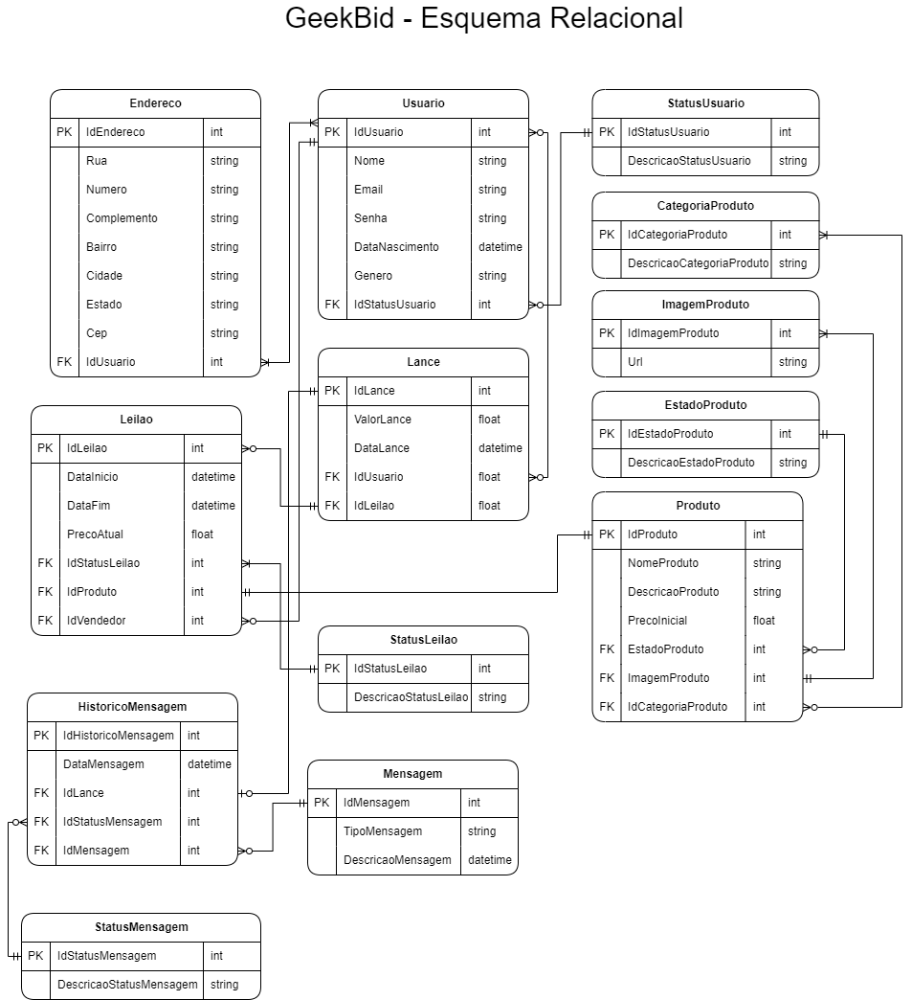

# Arquitetura da Solução

Pré-requisitos: <a href="3-Projeto de Interface.md"> Projeto de Interface</a>

Definição de como o software é estruturado em termos dos componentes que fazem parte da solução e do ambiente de hospedagem da aplicação.

## Diagrama de Classes

O diagrama de classes ilustra graficamente como será a estrutura do software, e como cada uma das classes da sua estrutura estarão interligadas. Essas classes servem de modelo para materializar os objetos que executarão na memória.

## Modelo Entidade-Relacionamento

O Modelo Entidade-Relacionamento representa através de um diagrama como as entidades (coisas, objetos) se relacionam entre si na aplicação interativa.

## Esquema Relacional

## Modelo Físico

Entregar um arquivo banco.sql contendo os scripts de criação das tabelas do banco de dados. Este arquivo deverá ser incluído dentro da pasta src\bd.

CREATE TABLE Endereco (
idEndereco SERIAL PRIMARY KEY,
rua VARCHAR(100),
numero VARCHAR(10),
complemento VARCHAR(50),
bairro VARCHAR(100),
cidade VARCHAR(100),
estado VARCHAR(2),
cep VARCHAR(9)
idUsuario INTEGER REFERENTES Usuario(idUsuario)
);

CREATE TABLE Usuario (
idUsuario SERIAL PRIMARY KEY,
nome VARCHAR(255),
email VARCHAR(255) UNIQUE,
senha VARCHAR(30),
dataNascimento TIMESTAMP,
genero VARCHAR(20),
idStatusUsuario INTEGER REFERENCES StatusUsuario(idStatusUsuario)
);

CREATE TABLE Leilao (
idLeilao SERIAL PRIMARY KEY,
dataInicio TIMESTAMP,
dataFim TIMESTAMP,
precoAtual NUMERIC(10, 2),
idStatusProduto INTEGER REFERENCES StatusProduto(idStatusProduto),
IdProduto INTEGER REFERENCES Produto(IdProduto),
IdVendedor INTEGER REFERENCES Usuario(idUsuario),
);

CREATE TABLE Lance (
idLance SERIAL PRIMARY KEY,
valorLance NUMERIC(10, 2),
dataLance TIMESTAMP,
IdComprador INTEGER REFERENCES Usuario(idUsuario),
idLeilao INTEGER REFERENCES Leilao(idLeilao)
);

CREATE TABLE ImagemProduto (
idImagemProduto SERIAL PRIMARY KEY,
url TEXT
);

CREATE TABLE CategoriaProduto (
idCategoriaProduto SERIAL PRIMARY KEY,
descricaoCategoriaProduto TEXT
);

CREATE TABLE EstadoProduto (
idEstadoProduto SERIAL PRIMARY KEY,
descricaoEstadoProduto TEXT
);

CREATE TABLE Produto (
idProduto SERIAL PRIMARY KEY,
nomeProduto VARCHAR(255),
descricaoProduto TEXT,
precoInicial NUMERIC(10, 2),
idCategoriaProduto INTEGER REFERENCES CategoriaProduto(idCategoriaProduto),
idEstadoProduto INTEGER REFERENCES EstadoProduto(idEstadoProduto),
idImagemProduto INTEGER REFERENCES ImagemProduto(idImagemProduto),
);

## Tecnologias Utilizadas

Arquitetura de componentes e ambiente de hospedagem:

**Aplicativo Móvel:**

O aplicativo móvel será desenvolvido em Reactive Native, pela facilidade de gerar elementos de inferface tanto para usuários de iOS quanto de Android.

**Backend:**

O backend será o cérebro do sistema, gerenciando toda a lógica de negócios, processamento de dados, gerenciamento de usuários e comunicação com o banco de dados. Pode ser desenvolvido usando uma arquitetura de microsserviços, onde cada função do sistema é separada em serviços independentes. Tecnologias como Node.js, Python (com frameworks como Flask ou Django) ou Java (com Spring Boot) podem ser utilizadas para desenvolver o backend.

**Banco de Dados:**

O banco de dados será responsável por armazenar todos os dados relacionados aos usuários, produtos, leilões, pedidos e outras informações essenciais do sistema. Um banco de dados relacional, como MySQL, PostgreSQL ou SQLite, pode ser utilizado para garantir integridade e consistência dos dados.

**Serviços de Terceiros:**

O sistema pode integrar serviços de terceiros para funcionalidades adicionais, como sistemas de pagamento (ex: PayPal, Stripe), serviços de autenticação (ex: Auth0, Firebase Authentication), e serviços de envio e logística (ex: Correios, FedEx).

**Hospedagem e Infraestrutura:**

O aplicativo e seus componentes podem ser hospedados em uma infraestrutura de nuvem, como Amazon Web Services (AWS), Google Cloud Platform (GCP) ou Microsoft Azure, para garantir escalabilidade, disponibilidade e segurança. Pode-se utilizar serviços como AWS Elastic Beanstalk, Google App Engine ou Azure App Service para implantar e gerenciar a aplicação de forma simplificada.
Monitoramento e Logging:

Implementar ferramentas de monitoramento e logging para acompanhar o desempenho, identificar possíveis problemas e garantir a estabilidade e disponibilidade do sistema. Ferramentas como AWS CloudWatch, Google Cloud Monitoring ou ELK Stack (Elasticsearch, Logstash, Kibana) podem ser utilizadas para essa finalidade.

Essa estrutura permite uma arquitetura escalável, modular e robusta para o aplicativo de leilão online, garantindo uma experiência confiável e satisfatória para os usuários, além de facilitar a manutenção e evolução contínua do sistema.

## Hospedagem

Explique como a hospedagem e o lançamento da plataforma foi feita.

O arquivo contendo o Diagrama de Classes, o Modelo Entidade-Relacionamento e o Esquema Relacional pode ser acessado [aqui](https://drive.google.com/file/d/19lwTGwUUOVjydgzok_bNiJ6nXujBxtfO/view?usp=sharing). Os esquemas foram confeccionados usando a ferramenta [draw.io](https://app.diagrams.net/).

## Qualidade de Software

Conceituar qualidade de fato é uma tarefa complexa, mas ela pode ser vista como um método gerencial que através de procedimentos disseminados por toda a organização, busca garantir um produto final que satisfaça às expectativas dos stakeholders.

No contexto de desenvolvimento de software, qualidade pode ser entendida como um conjunto de características a serem satisfeitas, de modo que o produto de software atenda às necessidades de seus usuários. Entretanto, tal nível de satisfação nem sempre é alcançado de forma espontânea, devendo ser continuamente construído. Assim, a qualidade do produto depende fortemente do seu respectivo processo de desenvolvimento.

A norma internacional ISO/IEC 25010, que é uma atualização da ISO/IEC 9126, define oito características e 30 subcaracterísticas de qualidade para produtos de software.
Com base nessas características e nas respectivas sub-características, identifique as sub-características que sua equipe utilizará como base para nortear o desenvolvimento do projeto de software considerando-se alguns aspectos simples de qualidade. Justifique as subcaracterísticas escolhidas pelo time e elenque as métricas que permitirão a equipe avaliar os objetos de interesse.

> **Links Úteis**:
>
> - [ISO/IEC 25010:2011 - Systems and software engineering — Systems and software Quality Requirements and Evaluation (SQuaRE) — System and software quality models](https://www.iso.org/standard/35733.html/)
> - [Análise sobre a ISO 9126 – NBR 13596](https://www.tiespecialistas.com.br/analise-sobre-iso-9126-nbr-13596/)
> - [Qualidade de Software - Engenharia de Software 29](https://www.devmedia.com.br/qualidade-de-software-engenharia-de-software-29/18209/)
