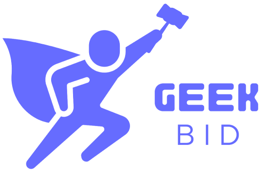

# Apresentação

## Título do Projeto

Geekbid

## Identidade Visual (Marca, Design)

Ver [Projeto de Interface](/docs/04-Projeto%20de%20Interface.md)

## Conjunto de Slides (Estrutura)

[Apresentação em pdf](/presentation/GeekBid.pdf) 

## Vídeo

[Vídeo](/

https://github.com/ICEI-PUC-Minas-PMV-ADS/pmv-ads-2024-1-e3-proj-mov-t2-geekbid/assets/101235591/c31b22de-ebcb-4c4f-8c05-17575125ab93

/...)
